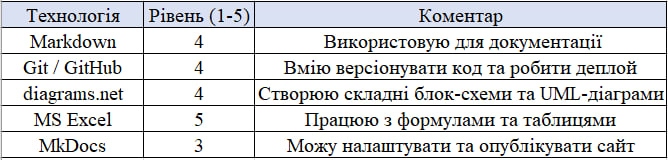

# Про мене

Я постійно вдосконалюю свої навички у сфері інформаційних технологій. Моя мета — створювати якісні та зрозумілі технічні рішення.

## Ключові компетенції
* Робота з системами контролю версій (Git, GitHub)
* Розробка документації мовою Markdown
* Проєктування алгоритмів та UML-діаграм
* Аналіз даних у MS Excel

## Рівень володіння технологіями
Нижче наведено мою самооцінку знань основних інструментів, підготовлену в MS Excel:

